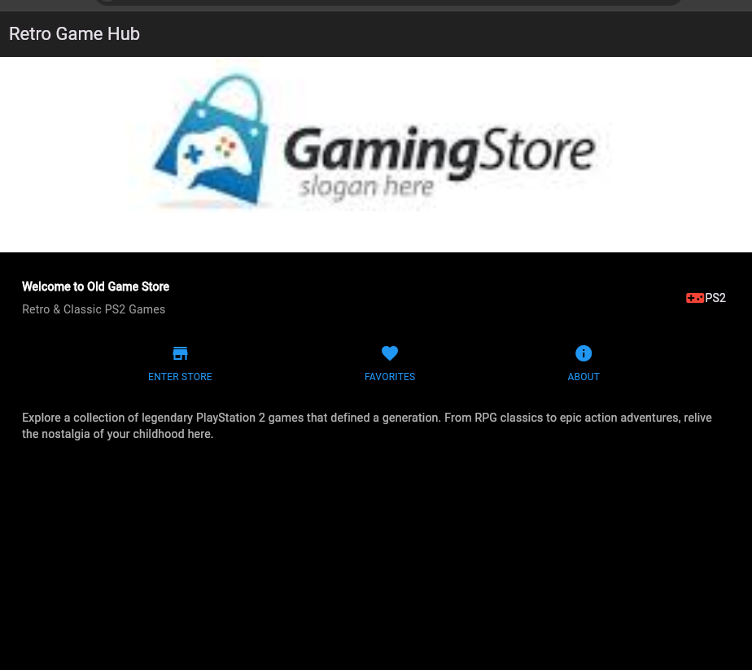
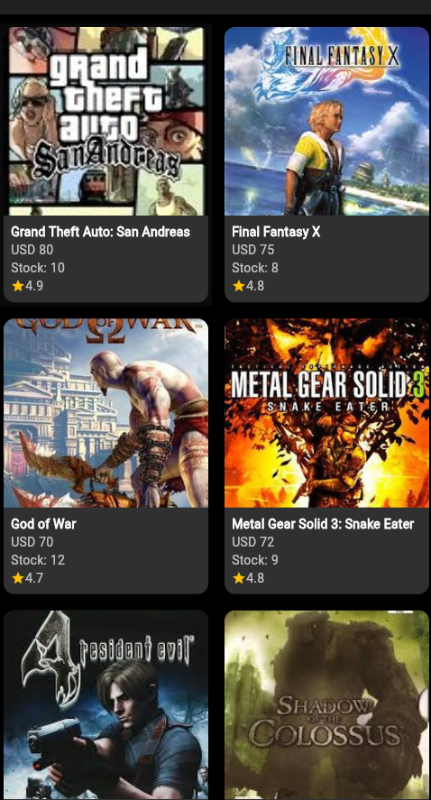
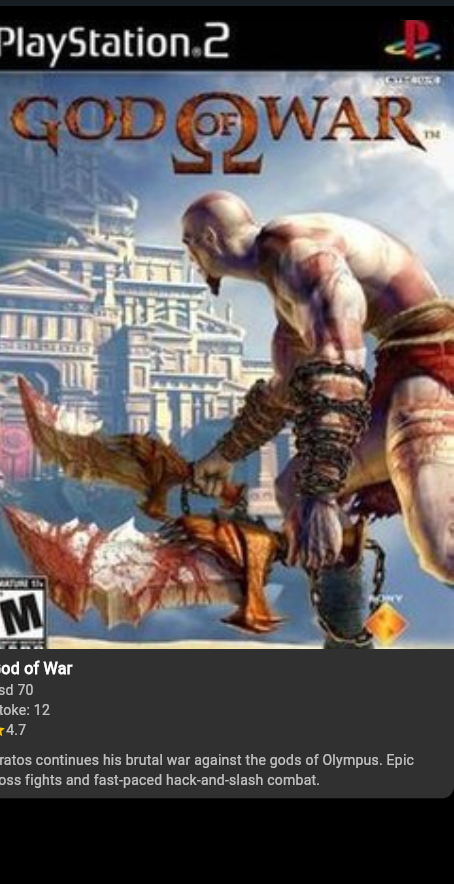

1. Pendahuluan
1.1 Latar Belakang
Praktikum ini bertujuan untuk mempelajari mekanisme tata letak (layout) di Flutter, termasuk penggunaan widget dasar seperti Row, Column, ListView, serta pengelolaan aset gambar. Flutter sebagai framework UI open-source memungkinkan pengembangan aplikasi lintas platform dengan pendekatan berbasis widget.
Selain itu, dilakukan pengembangan tambahan berupa implementasi halaman toko game (PS2 Game Store) yang terhubung melalui navigasi dari halaman utama. Dengan demikian, praktikum ini tidak hanya menekankan pada dasar layout, tetapi juga praktik langsung penggunaan navigasi dan integrasi multi-halaman.
1.2 Tujuan
Memahami mekanisme tata letak Flutter.
Mampu menata widget menggunakan Row, Column, dan ListView.
Mengimplementasikan elemen UI seperti gambar, teks, dan tombol dalam aplikasi Flutter.
Menggunakan navigasi untuk menghubungkan halaman utama dengan halaman toko game.

2. Alat dan Bahan
Editor: Visual Studio Code

Flutter SDK

Plugin Flutter untuk VS Code

Android SDK (untuk emulator)

GitHub (untuk menyimpan laporan)

Gambar:

assets/

Cover game PS2 (gta_sa.jpg, ffx.jpg, dll.)

3. Metode
3.1 Praktikum 1: Layout Dasar
Membuat project layout_flutter.

Menampilkan teks dan judul sederhana dengan Row dan Column.

3.2 Praktikum 2: Button Row
Membuat metode _buildButtonColumn.

Menambahkan tombol dengan ikon + label ke dalam Row.

3.3 Praktikum 3: Text Section
Membuat deskripsi teks dengan padding dan softWrap.

3.4 Praktikum 4: Image Section
Menambahkan Image.asset dengan BoxFit.cover.

Mengganti Column menjadi ListView agar mendukung scroll.

4. Hasil dan Pembahasan
hasil:

4.3 Analisis
Row & Column efektif untuk menata elemen UI.
ListView sangat membantu untuk konten panjang agar bisa scroll.
integrasi navigasi menambah pengalaman aplikasi lebih realistis.
Tampilan game store menyerupai katalog toko game jadul.
5. Kesimpulan
Praktikum ini berhasil mengimplementasikan layout dasar Flutter (Praktikum 1–4) dengan elemen gambar, teks, dan tombol. Selain itu, dilakukan integrasi halaman shope yang terhubung melalui navigasi, sehingga aplikasi lebih interaktif.
Pemahaman tentang widget dasar (Image.asset, Row, Column, ListView) serta navigasi (Navigator.push) semakin meningkat. Praktikum ini juga melatih pengelolaan aset dan penerapan konsep multi-halaman dalam Flutter.

1. Validasi Input: Tambahkan validasi yang lebih baik. Misalnya, cek apakah email
memiliki format yang benar (mengandung ’@’) atau password memiliki panjang
minimal 6 karakter.
2. Tampilkan/Sembunyikan Password: Tambahkan ikon mata pada TextField
password yang bisa ditekan untuk menampilkan atau menyembunyikan teks password.
3. Animasi Sederhana: Tambahkan Hero widget pada ikon di halaman login dan
registrasi agar ada transisi animasi yang halus.
4. Simpan Sesi Login: Coba gunakan package shared_preferences untuk menyimpan status login. Jadi, saat aplikasi ditutup dan dibuka lagi, pengguna tidak
perlu login ulang jika sesinya masih aktif.

